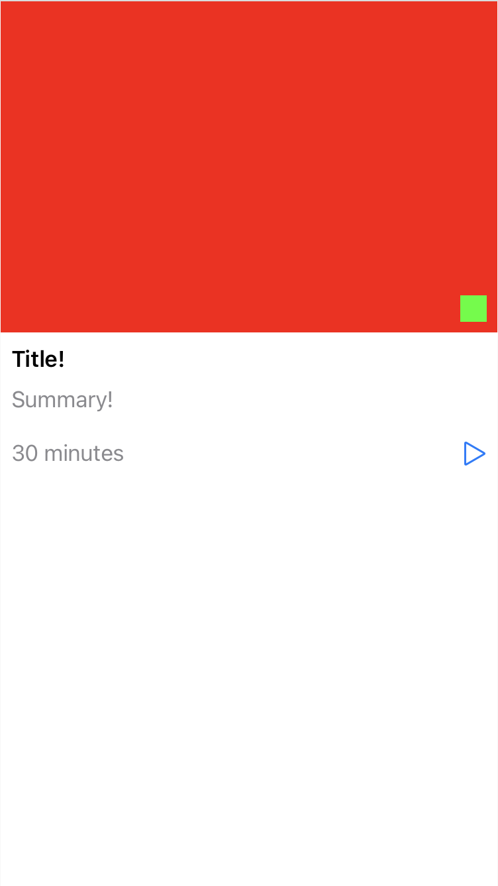

# Layout <!-- omit in toc -->

- [Availability and Requirements](#availability-and-requirements)
- [Creating Constraints](#creating-constraints)
- [View builder DSL](#view-builder-dsl)
- [`UIView` and `UILayoutGuide`](#uiview-and-uilayoutguide)
- [Autoresizing Mask](#autoresizing-mask)
- [Debugging Constraints](#debugging-constraints)
- [License](#license)

An expressive and extensible DSL for creating Auto Layout constraints and defining declarative layouts.

## Availability and Requirements

- Available as a Swift Package.
- Requires Xcode 12 or higher.
- Supports iOS 13+, and tvOS 13+.

## Creating Constraints

``` swift
// Creating inactive constraints (save and activate/manipulate later)
let constraints = view.makeConstraints {
  Center()
  Size(width: 100, height: 100)
}
```

``` swift
// Creating active constraints
view.applyConstraints {
  Center()
  Size(width: 100, height: 100)
}
```

## View builder DSL

Create UIKit layouts with a view builder DSL.

``` swift
UIStackView.vertical(spacing: 10) {
    image
        .overlay {
            badge.constraints {
                AlignEdges([.bottom, .trailing], insets: 8)
                Size(width: 20, height: 20)
            }
        }
        .constraints {
            AspectRatio(3 / 2)
        }

    UIView.build {
        UIStackView.vertical(spacing: 10) {
            titleLabel

            summaryLabel
                .spacingAfter(20)

            UIStackView.horizontal {
                timeLabel
                HorizontalSpacer()
                playButton
            }
        }
        .constraints {
            AlignEdges(insets: .init(top: 0, leading: 8, bottom: 0, trailing: 8))
        }
    }

    VerticalSpacer()
}
```

Generates this layout:



## `UIView` and `UILayoutGuide`

`makeConstraints` and `applyConstraints` operate on both `UIView` and `UILayoutGuide`. All constraints that are setup up in relation to other items may also be either `UIView` or `UILayoutGuide`.

``` swift
button.applyConstraints {
  Center(in: view.safeAreaLayoutGuide), // relating to a `UILayoutGuide`
  Size(to: otherButton) // relating to a `UIView`
}
```

Constraints that are related to another item default to the receiver’s parent view. Therefore, the following two examples are identical:

``` swift
// Preferred
button.applyConstraints {
  Center()
}
```

``` swift
// Not-preferred
button.applyConstraints {
  Center(in: button.superview)
}
```

## Autoresizing Mask

Layout sets `translatesAutoresizingMaskIntoConstraints` to `false` on the receiver of the `makeConstraints` and `applyConstraints` calls.

## Debugging Constraints

Layout automatically adds debug identifiers to all constraints that include the file, and line number of where the constraint was created.

You may also set custom identifiers:

``` swift
button.applyConstraints {
  Center() <- "my first custom identifier"
}
```

## License

This code and tool is under the MIT License. See `LICENSE` file in this repository.
